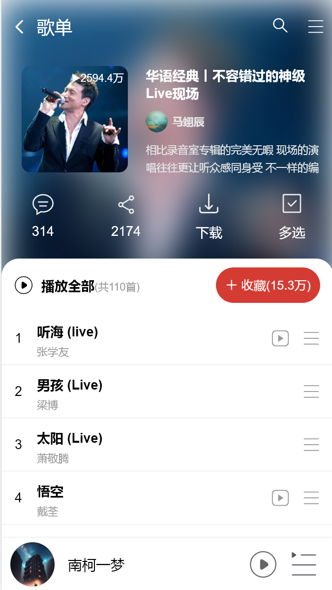

# vue3-music

## 技术栈
- vue3
- vant
- axios

## 接口
- 网易云音乐Api项目地址： https://github.com/Binaryify/NeteaseCloudMusicApi
- 接口文档： https://binaryify.github.io/NeteaseCloudMusicApi/#/

## 完成界面
### 首页

### 歌单详情页

### 播放页
> 完成了进度条控制播放、播放控制歌词滚动 (歌词滚动控制播放进度试了好几种方法都没搞定)

